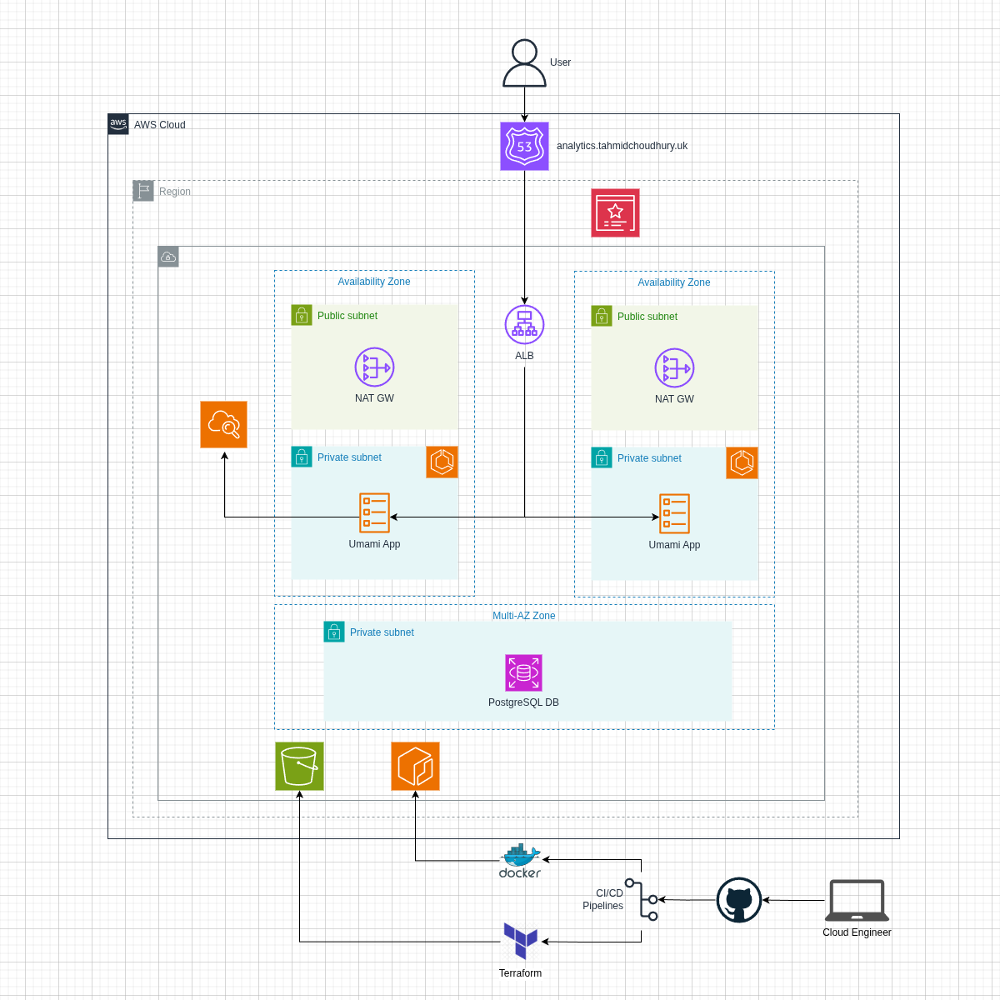
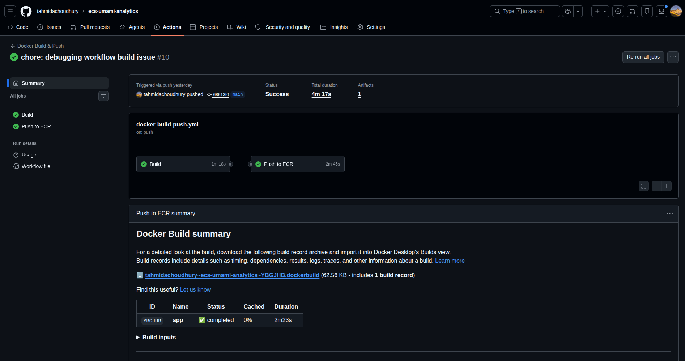
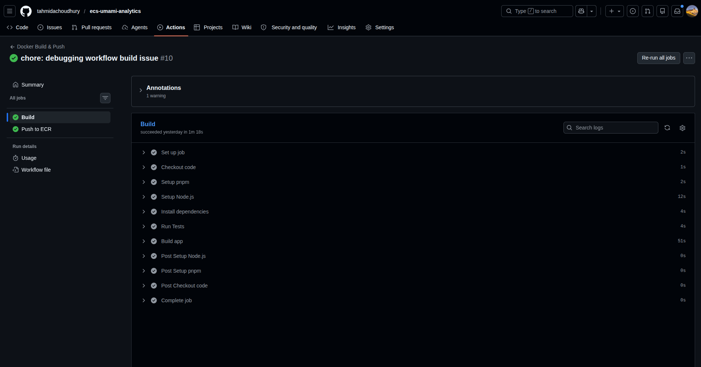
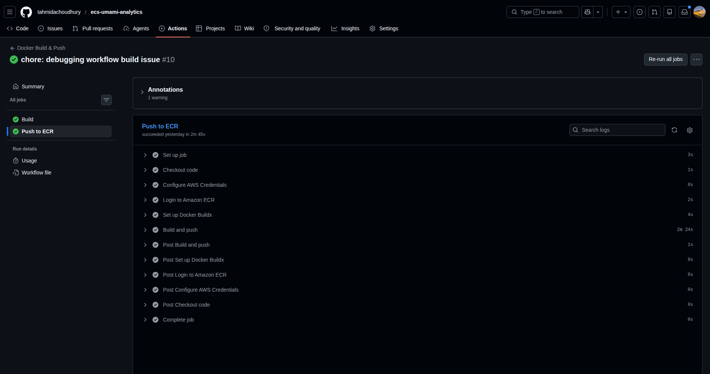
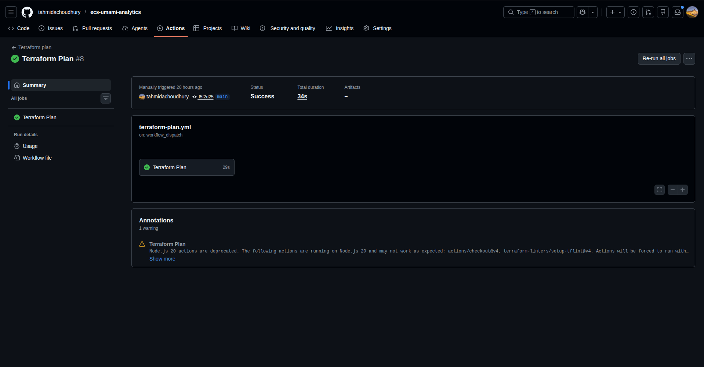
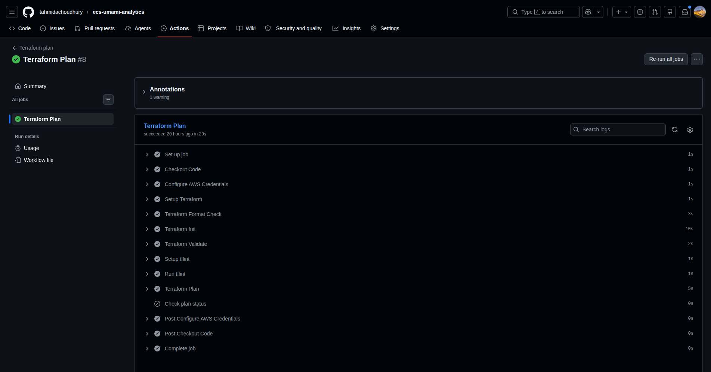
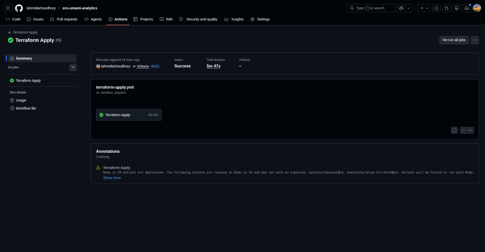
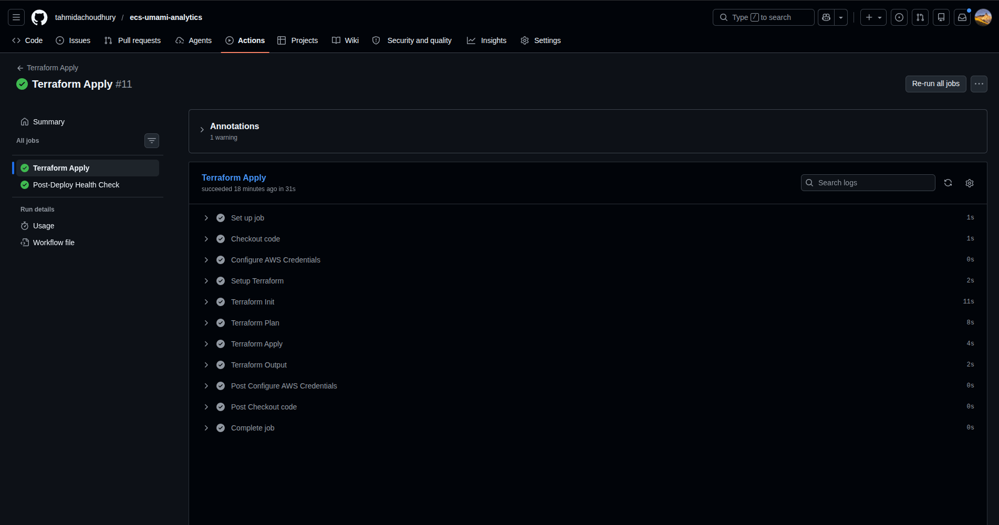
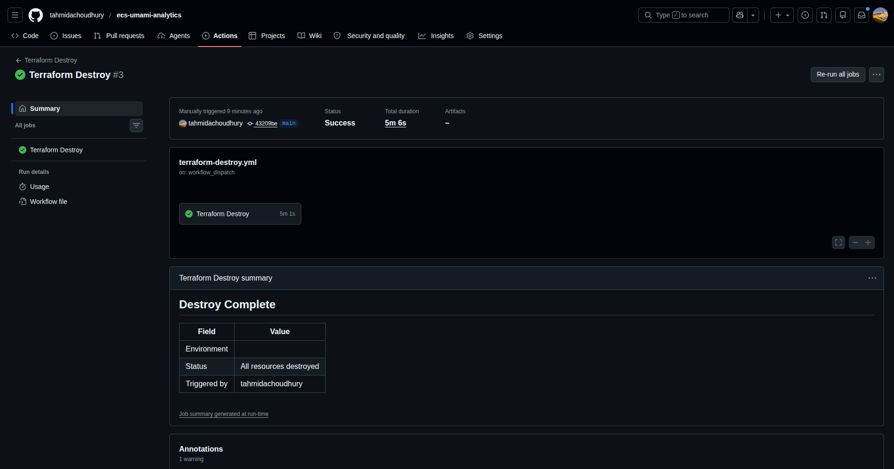
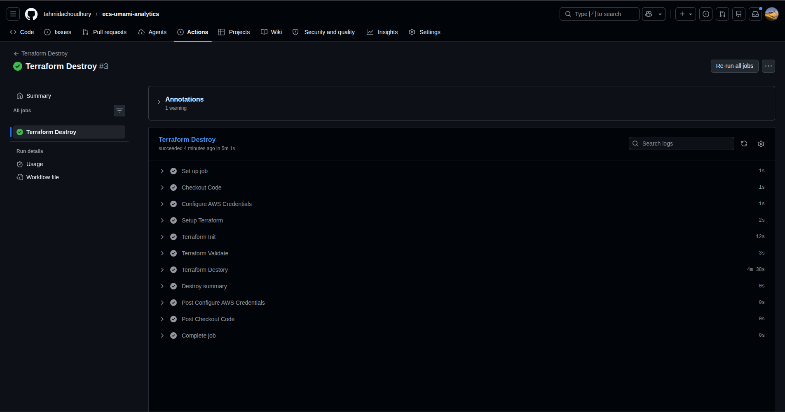

# Umami Analytics: Deployed via AWS ECS Fargate and IaC

Production-style AWS ECS Fargate deployment provisioned with Terraform and automated through GitHub Actions CI/CD pipelines. This project includes ECS, ECR, ALB, ACM, Route53, RDS PostgreSQL, Docker, observability, and secure infrastructure design using modular Infrastructure as Code principles.

---

### Table of Contents

- [Demo](#demo)
- [Architecture](#architecture)
- [Technology Stack](#technology-stack)
- [Repository Structure](#repository-structure)
- [Local Development](#how-to-set-up-locally)
- [CI/CD](#cicd)
- [Author](#author)

---

## Demo

…

---

## Architecture



The infrastructure is designed for high availability, security, and scalability.

Key components:

- VPC with public and private subnets across multiple AZs
- Application Load Balancer (ALB) with a health check on `/api/heartbeat`
- ECS Fargate service running tasks in private subnets
- CloudWatch enabled for DB and Task logs
- NAT Gateway for outbound internet access from private subnets
- ACM certificate for HTTPS
- Route 53 for DNS
- S3 for a remote Terraform statefile with state-lock enabled
- GitHub Actions for CI/CD using OIDC

---

## Technology Stack

### Cloud & Infrastructure

- AWS ECS Fargate
- AWS ECR
- AWS ALB (Application Load Balancer)
- AWS Route53
- AWS ACM
- AWS RDS PostgreSQL
- AWS VPC

### Infrastructure as Code

- Terraform
- Modular Terraform Architecture

### CI/CD & Automation

- GitHub Actions
- Docker
- Docker Compose

### Backend & Application

- PostgreSQL
- Umami Analytics
  - Node.js

### Networking & Security

- Security Groups
- Public & Private Subnets
- NAT Gateway
- IAM Roles & Policies
- HTTPS / TLS

---

## Repository Structure

```sh
app
├── docker-compose.yml
├── Dockerfile
└── src
    └── app
        └── api
            └── heartbeat
...
infra
├── bootstrap
│   ├── main.tf
│   ├── modules
│   │   └── ecr
│   │       ├── main.tf
│   │       ├── outputs.tf
│   │       └── variables.tf
│   ├── provider.tf
│   └── variables.tf
├── envs
├── modules
│   ├── acm
│   │   ├── main.tf
│   │   ├── outputs.tf
│   │   └── variables.tf
│   ├── alb
│   │   ├── main.tf
│   │   ├── outputs.tf
│   │   └── variables.tf
│   ├── application
│   │   ├── main.tf
│   │   ├── outputs.tf
│   │   └── variables.tf
│   ├── cloudwatch
│   │   ├── main.tf
│   │   ├── outputs.tf
│   │   └── variables.tf
│   ├── dns
│   │   ├── main.tf
│   │   ├── outputs.tf
│   │   └── variables.tf
│   ├── ecs
│   │   ├── main.tf
│   │   └── variables.tf
│   ├── iam
│   │   ├── main.tf
│   │   ├── outputs.tf
│   │   └── variables.tf
│   ├── networking
│   │   ├── main.tf
│   │   ├── outputs.tf
│   │   └── variables.tf
│   ├── rds
│   │   ├── main.tf
│   │   ├── outputs.tf
│   │   └── variables.tf
│   └── security_groups
│       ├── main.tf
│       ├── outputs.tf
│       └── variables.tf
├── backend.tf
├── main.tf
├── outputs.tf
└── variables.tf
.github
└── workflows
    ├── docker-build-push.yml
    ├── terraform-apply.yml
    ├── terraform-destroy.yml
    └── terraform-plan.yml
```

---

## How to set up locally

### 1. Clone the repository

```bash
# By HTTPS
git clone https://github.com/tahmidachoudhury/ecs-umami-analytics.git
# OR by SSH
git clone git@github.com:tahmidachoudhury/ecs-umami-analytics.git

cd ecs-umami-analytics
```

### 2. Create an environment file

Create a `.env` file in the root of the project:

```bash
touch .env
```

Add the required environment variables:

```env
DATABASE_URL=postgresql://umami:umami@db:5432/umami
APP_SECRET=your-random-secret
```

### 3. Start the application

The Docker Compose file contains everything needed to run the app locally.

```bash
docker compose up --build
```

### 4. Open the app

Once the containers are running, visit:

```text
http://localhost:3000
```

### 5. Stop the application

```bash
docker compose down
```

### 6. Remove volumes and reset the database

Use this if you want a clean local reset:

```bash
docker compose down -v
```

---

## CI/CD

### 1. Docker Build & Push



#### 1a. Docker Build



#### 1b. Push to ECR



### 2. Terraform Plan



#### 2a. Terraform Plan Steps



### 3. Terraform Apply



#### 3a. Terraform Apply Steps



### 4. Terraform Destroy



#### 4a. Terraform Destroy Steps



---

## Author

**Tahmid Choudhury** - DevOps Engineer

---

### **Connect**

<p align="center">
  <a href="https://www.linkedin.com/in/t-a-choudhury/" target="_blank" rel="noopener noreferrer">
    
  </a>
  <a href="https://www.tahmidchoudhury.uk" target="_blank" rel="noopener noreferrer">
    
  </a>
  <a href="https://github.com/tahmidachoudhury" target="_blank" rel="noopener noreferrer">
    
  </a>
</p>
